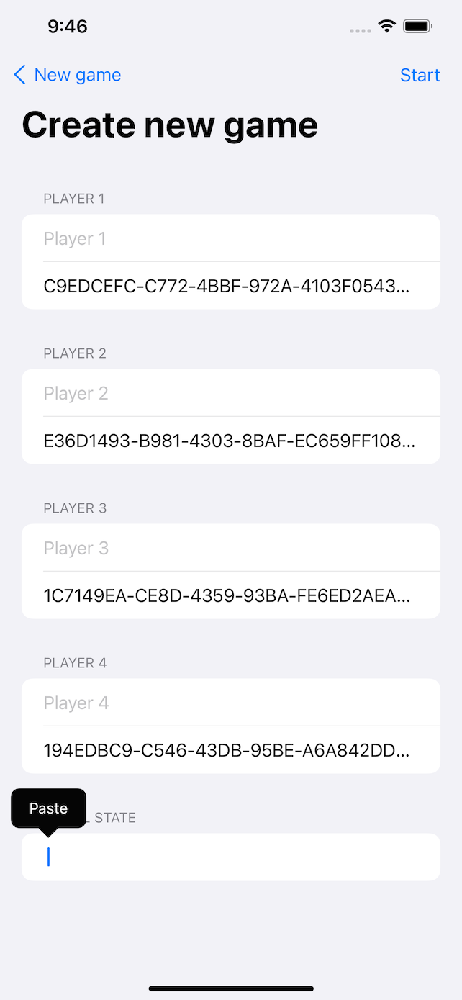
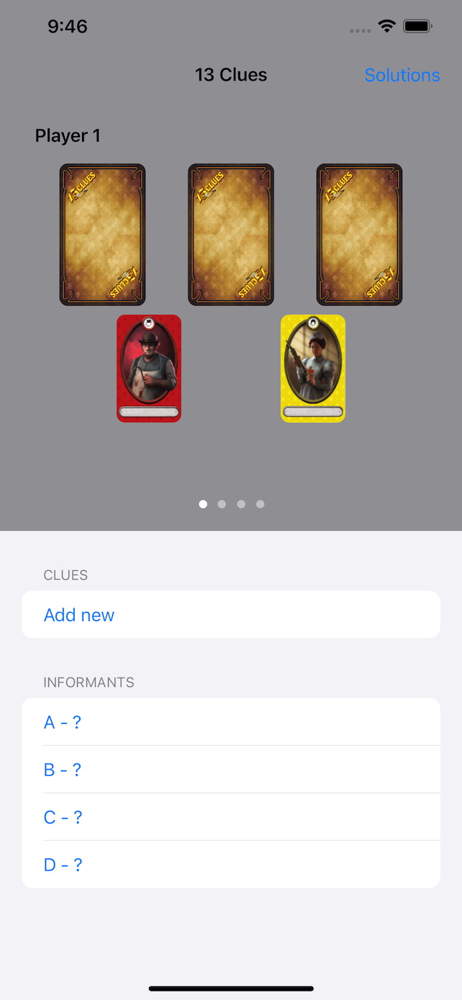

# Fourteenth Clue

Solution solver for the board game 13 Clues.

## Usage

### iOS App

If you're using the iOS app to solve your game of 13 Clues, then you can read the following section on how to get your game's state loaded into the app, ready for solving.

The initial state is built in `GameBuilder`, which primarily accepts a JSON object that you can get from a BoardGameArena game following these steps"

1. Once the game starts on [BoardGameArena](https://en.boardgamearena.com), the first thing you'll need to do is choose 3 cards to hand to another player as their mystery. While this screen is available, open your web browser's console and paste the following:

```
var initialGameStateForCopy = null;
var orig = gameui.notif_onCombinaisonAssigned;
gameui.notif_onCombinaisonAssigned = function (e) {
  try {
    console.log(e.args.visible_cards_players);
    initialGameStateForCopy = JSON.stringify(e.args.visible_cards_players);
    console.log(initialGameStateForCopy)
    orig.call(this, e);
  } catch (e) {
    console.log("joseph" + e);
  }
}
```

2. After you start the game, note the output with each player's state, that'll look somewhat similar to the following, and copy it into the text area at the bottom of the `GameBuilder`:

```
{
  "85268622":[{"name":"Officer"},{"name":"Sword"},{"name":"Park"}],
  "87792535":[{"name":"Duke"},{"name":"Harbor"},{"name":"Blowgun"}],
  "87978988":[{"name":"Countess"},{"name":"Library"},{"name":"Knife"}],
  "88584546":[{"name":"Butcher"},{"name":"Nurse"}]
}
```

3. From there, you can start the game in Fourteenth Clue, and you'll see a state similar to the one presented to you in BoardGameArena.

| GameBuilder | Initial game state |
|-------------|--------------------|
|  |  |

Once you have the initial state of the game set up, you can continue to modify the state through the UI:

- Change a player's mystery or hidden cards by tapping the card position and selecting a new card from the list that appears.
- Add a new clue by tapping "Add clue" and completing the form presented.
- Reveal a secret informant by tapping the informant's position and selecting which card it represents from the list that appears.

As you modify the state, recording the clues that are asked and answered during the course of the game, the app will attempt to calculate the most likely solution to your mystery, through the approaches described below.
